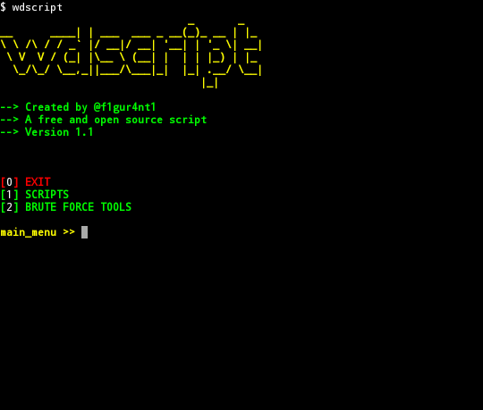
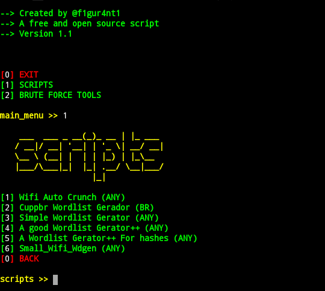

WdGen_Script (Version v 1.1)
===============================

Usage :

      $ apt-get install python3 
      $ git clone https://github.com/f1gur4nt1/wdgen_script/
      $ cd wdgen_script
      $ sh run.sh
      $ sh install.sh
      $ bash
      $ wdscript

Main Menu:

Scripts Menu:

Thanks (^_^)
